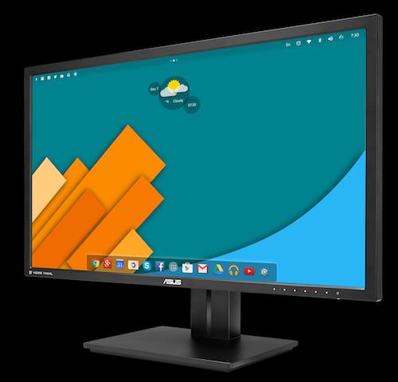
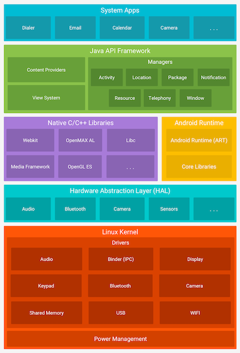
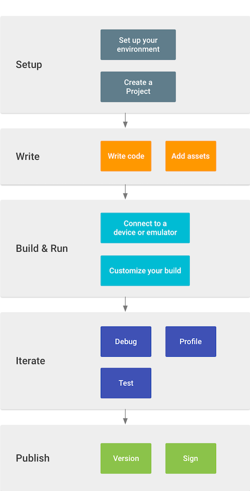

# Intro to Android

Roman Smirnov

# Space, the final frontier

> These are the voyages of a developer, his continuing mission:  to explore strange new frameworks, to seek out new libraries and new design patterns, to boldy code what no one has yet uploaded to Github. 

# The Universe of Android 

| Watches             | TVs           | Consoles                |
| ------------------- | ------------- | ----------------------- |
|  |  |  |

| Cars             | Fridges               | Coffee Makers         |
| ---------------- | --------------------- | --------------------- |
|  |  |  |

| Desktop                 | Treadmill                   | Autonomous Cars                   |
| ----------------------- | --------------------------- | --------------------------------- |
|  |  |  |

# Why Android Matters

### Proven and Widely Used

* \> 2 billion active users
* ~90% of mobile devices
* ~40% of all internet connected devices

### Not Just Java 

* Android development is not limited to Java - can develop in C, C++, Python, etc.
* Android is a Linux based open-source operating system.

# Today's Adventure

1. How Android works as an Operating System.
2. How to develop for Android, run and publish apps.  
3. How our code is compiled and run.
4. Build an app together and run it. 

# Android OS  

## Overview

# Android OS

## Purpose, Structure, Operation

# Android Studio

| Our Starship                  | Kirk's Starship                      |
| ----------------------------- | ------------------------------------ |
|  |  |

- Free and open-source
- Based on Intellij IDE - easy to use, looks good, works well, numerous features
- It's possible to develop with something else - not recommended.

# Development Workflow

# Minimum API Level

- Don't be scared - we can change everything later!
- Each new release happens ~1 per year and brings improvements and new features. 
- Min SDK - the minimum OS version on which the app will run.
- Apps are are forward compatible for many years, can also be easily updated. 
- OEMs usually ship phones with the latest available version and provide OTA updates and support for ~2 years.
- There are support libraries, inependent of API level, which bring new features to older Android versions.
- Devices not approved by Google don't get support and extension libraries.

# Activity

### Concept 

- It's a single "screen" in our app
- It's a window/gateway into the Android framework
- It's a stand-alone piece of the app

### Practice

- It's a Java class we inherit from
- For anything the user does - an activity method gets called
- For anything we want to do - we call it

# Layouts and Resources

