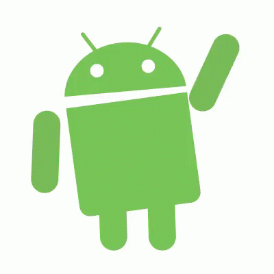

# Intro to Android

Roman Smirnov

---

# Space, the final frontier

> ... to explore strange new wolrds, to seek out new life and new civilizations ...

---

# The Universe That Is Android 

| Watches             | TVs           | Consoles                |
| ------------------- | ------------- | ----------------------- |
|  |  |  |

| Cars             | Fridges          |   Treadmill        	  |
| ------------------- | ------------- | ----------------------- |
|  |  |  |

---

# A Universe Full of Surprises

| Desktop             | Coffee Makers  | Autonomous Cars  		|
| ------------------- | ------------- | ----------------------- |
|  |  |  |

---

# Why Android Matters

#### Proven and Widely Used

* Not just Google
* \> 2 billion active users
* ~90% of mobile devices
* ~40% of all internet connected devices

#### Not Just Java 

* Android development is not limited to Java - can develop in C, C++, Python, etc.
* Android is a Linux based open-source operating system.

--- 

# Today's Adventure

---

# What We'll Learn

- How it works. 
- How to develop for it.
- Build an app together.

---

# Android Operating System

---

# Overview

---

# Purpose, Structure, Operation

---

# Android Studio

| Our Starship                  | Kirk's Starship                      |
| ----------------------------- | ------------------------------------ |
|  |  |

- Free and open-source
- Based on Intellij IDE - easy to use, looks good, works well, numerous features
- It's possible to develop with something else - not recommended.

---

# Development Workflow

---

# Minimum API Level

- Don't be scared - we can change everything later!
- Each new release happens ~1 per year and brings improvements and new features. 
- Min SDK - the minimum OS version on which the app will run.
- Apps are are forward compatible for many years, can also be easily updated. 
- OEMs usually ship phones with the latest available version and provide OTA updates and support for ~2 years.
- There are support libraries, inependent of API level, which bring new features to older Android versions.
- Devices not approved by Google don't get support and extension libraries.

---

# Activity

### Concept 

- It's a single "screen" in our app
- It's a window/gateway into the Android framework
- It's a stand-alone piece of the app

### Practice

- It's a Java class we inherit from
- For anything the user does - an activity method gets called
- For anything we want to do - we call it

---

# Layouts and Resources

